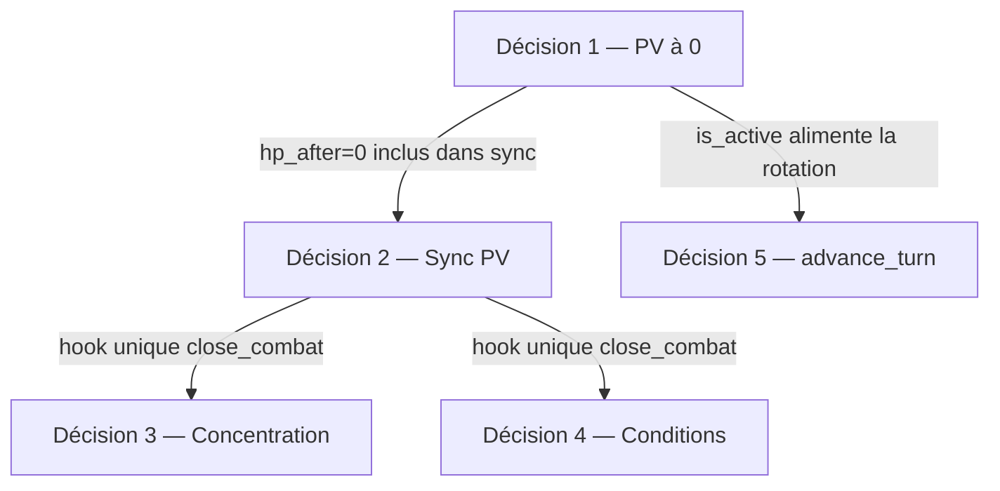

# ADR-005 — Transition fin de rencontre

| Attribut | Valeur |
|---|---|
| **Statut** | Accepté |
| **Date** | 2026-08-05 |
| **Décideurs** | Lead Architect, Product Owner |
| **Contexte** | ÉTAPE 4 — clôture de la dette groupée ADR-004 §333 (lots C0–C7 livrés, 797 tests) |
| **Remplace / complète** | ADR-004 décisions 1, 2, 9 ; bloc « Dette groupée — fin de combat » (§333) |

---

## Contexte

Les lots C0–C7 ont livré un moteur de combat persistant (blob `CombatState` SQLite, journal événementiel C7). Cinq ambiguïtés de **transition d'état** identifiées dès C1 ont été documentées dans ADR-004 §333, puis **persistées telles quelles** sans être tranchées :

1. PV à 0 — pas de flag mort/inconscient, `is_active` reste `True`
2. Sync PV overlay combat → fiche `Character` en fin de rencontre
3. Double source concentration (overlay `concentration_spell_id` vs `choices.spellcasting.concentration`)
4. Sync conditions overlay → fiche `Character` en fin de rencontre
5. `advance_turn` avec ≤1 combattant actif / comportement mid-crash

Chaque lot futur touchant `Combatant`, PV ou conditions s'appuie implicitement sur l'état actuel de ces questions. Ce document les tranche **avant tout code d'implémentation**.

### Tension ADR-004 §1 vs §9 — résolution temporelle

- **Décision 1** (ADR-004) : hors combat, `Character.hp_current` est la source de vérité.
- **Décision 9** (ADR-004, C3a) : **pendant** la rencontre, PV et CA vivent sur l'overlay `Combatant`.
- **Pont** : `close_combat` (décision 2 ci-dessous) synchronise overlay → fiche.

Le code actuel suit §9 pendant le combat (`test_apply_damage_updates_combat_not_character`). ADR-005 acte explicitement cette règle temporelle.

### Couplages entre points

**Ordre de lecture recommandé** : 1 → 5 → 2 → (3 et 4 en parallèle).

### Hors périmètre explicite

| Élément | Report | Motif |
|---|---|---|
| Buffs overlay incohérents (`blessed`, `hunters_mark_caster_id`) | **Lot B4** (prioritaire, distinct) | Déjà tranché ADR-004 |
| Sauvegardes contre la mort / mort instantanée | Post privatives C6 | SRD complet non MVP |
| Condition `unconscious` auto à 0 PV | C6 privatives | Couplage concentration par incapacité |
| Suppression du champ `concentration_spell_id` du blob | Dette post ADR-005 | Bump `schema_version` |
| Modèle conditions persistantes SRD sur fiche | Post-B4 / compendium conditions | Fausse précience sans horloge |
| Sync PV à chaque `DamageDealt` | Rejeté | Contredit overlay §9 |
| Auto-close à 1 survivant (victoire implicite) | Report | Pas de notion de camp dans `Combatant` |
| Affichage historique conditions (UI / journal C7) | Client / ÉTAPE 6 | Pas de risque schéma |

**Symétrie B4 / conditions (décision 4)** : persister `poisoned` sur la fiche sans horloge ni guérison reproduirait le défaut latent B4 sur les buffs — état mécanique sans modèle de temps derrière. Les deux sont traités par discard / activation explicite future.

---

## Décision 1 — PV à 0 : retrait de la rotation active

### Question

Quand `apply_damage` porte `Combatant.hp_current` à **0**, que signifie-t-on **mécaniquement** pour la suite de la rencontre — sachant que le blob persiste aujourd'hui `hp_current=0`, `is_active=True`, et que le combattant **reste éligible aux tours** ?

### Décision

À **`hp_after == 0`** dans `apply_damage` : **`is_active=False`**.

Le combattant **reste dans** `initiative_order` et dans `state.combatants` (comme après `remove_combatant` pour la rotation, mais **sans** retirer l'entrée d'initiative).

### Justification SRD (simplification MVP)

SRD 2014 : à 0 PV, une créature est **inconsciente** (sauf mort instantanée par dégâts massifs — hors MVP) et **incapable d'agir**. Retirer le combattant de la rotation active (`is_active=False`) est une simplification acceptable tant que les **sauvegardes contre la mort** ne sont pas modélisées.

### Événements

**`DamageDealt` suffit** (`hp_after=0`). Pas de nouvel événement obligatoire en MVP. Un futur `CombatantDowned` reste optionnel si le journal ou un client en a besoin.

### Alternatives rejetées

| Alternative | Motif de rejet |
|---|---|
| Statu quo (`is_active=True` à 0 PV) | Incohérence persistante avec rotation et point 5 |
| Condition `unconscious` overlay auto | Ouvre privatives C6, rupture concentration par incapacité — report |
| Flag dédié `is_downtime` | Complexité schéma sans gain MVP |

### Conséquences

- Blob : `hp_current=0`, `is_active=False`.
- Couplage fort avec décision 5 (`next_active_turn_index` skip les inactifs).
- **Impact tests 797** : faible — sauf tests futurs supposant un tour jouable à 0 PV.

---

## Décision 2 — Sync PV overlay → fiche à `close_combat`

### Question

`close_combat` ne modifie aujourd'hui que `status=ended`. Quelle est la **règle de vérité après clôture**, et que se passe-t-il si le processus crash **avant** `close_combat` ?

### Décision

**À `close_combat`**, pour **chaque** combattant du blob (actif ou non, y compris `hp_current=0`) :

1. `character.hp_current ← combatant.hp_current`
2. Persistance via `CharacterRepository.save`
3. **Ne pas** synchroniser `hp_max` ni `ac` overlay (dérivés fiche / compendium)

**Pendant** la rencontre : overlay `Combatant` seul fait foi — aucune écriture fiche sur `DamageDealt`.

### Justification

SRD : les PV perdus **persistent** après la rencontre. Sync-on-close aligne overlay §9 et fiche §1 sans sync continue.

**Crash mid-combat** : le blob reste la vérité de reprise ; la fiche reste au snapshot pré-combat jusqu'à clôture — **limite connue**, documentée.

### Alternatives rejetées

| Alternative | Motif de rejet |
|---|---|
| Sync à chaque `DamageDealt` | Contredit modèle overlay ; écritures fréquentes |
| Snapshot pré-combat + merge conditionnel | Contredit SRD |
| Pas de sync — overlay perdu | Contredit attentes API / joueur |

### Conséquences

- `test_apply_damage_updates_combat_not_character` **reste valide** (pendant le combat).
- Nouveaux tests sur `close_combat` → fiche mise à jour.
- **Impact tests 797** : aucune rupture sur existants si tests additivement ; rupture si un test supposait fiche inchangée **après** close.

---

## Décision 3 — Concentration : `choices` fait foi ; overlay dérivé

### Question

`choices.spellcasting.concentration` (ADR-004 §2) et `Combatant.concentration_spell_id` (overlay C3b) sont écrits en parallèle, partiellement nettoyés à la rupture C5, jamais réconciliés à la clôture. **Quelle source fait foi post-rencontre ?**

### Décision — phase 1 (immédiate)

- **Source persistée post-rencontre** : **`choices.spellcasting.concentration` uniquement** (confirme ADR-004 §2).
- **À `close_combat`** : réconciliation overlay → fiche via `set_concentration` / `clear_concentration` si divergent ; puis `CharacterRepository.save`.
- **À `load_combat`** (combat ouvert) : **hydrater** `concentration_spell_id` depuis la fiche si overlay absent (reprise mid-crash cohérente avec fiche).

Le champ **`concentration_spell_id` reste stocké dans le blob** en phase 1 — double écriture pendant le combat conservée.

### Dette — phase 2 (reportée)

Supprimer le champ stocké overlay ; concentration combat = **vue dérivée** de `choices` uniquement. Nécessite bump `COMBAT_STATE_VERSION` et migration blob — **hors ADR-005**, ne pas bloquer la sémantique.

### Événements

Inchangés. `ConcentrationBroken` (C5) continue de nettoyer les deux chemins.

### Conséquences

- **Impact tests 797** : modéré — tests concentration overlay/fiche (`test_hunters_mark_concentration_and_mark_persist`, etc.) à adapter si hydration/load change.

---

## Décision 4 — Conditions overlay : discard à la clôture

### Question

C6 a acté : conditions sur overlay, jamais sur fiche **pendant** le combat. Après `close_combat`, le blob `ended` peut contenir `conditions=("poisoned",)`. **Les conditions sont-elles des états de rencontre ou de personnage ?**

### Décision

**Encounter-scoped** : à `close_combat`, les conditions overlay **ne sont pas propagées** sur `Character`. L'effet mécanique **se termine avec la rencontre**.

Le blob `ended` **peut conserver** `conditions` comme **archive historique** — sans effet sur fiche ni reprise mécanique.

Pas de `ConditionRemoved` systématique à close (optionnel, non requis).

### Justification

C6 n'a ni durée, ni guérison, ni compendium conditions. Persister `frightened` / `poisoned` sur la fiche créerait un **état actif mensonger** sur `/perso-afficher` — même classe de défaut que les buffs overlay B4 sans modèle de temps.

La persistance SRD de `poisoned` au-delà du combat relève d'un **futur modèle de conditions persistantes** (post-B4, compendium) — explicitement reporté.

### Alternatives rejetées

| Alternative | Motif de rejet |
|---|---|
| Sync → `choices.transient_conditions` | Fausse précision sans horloge |
| Sync sélective SRD | Requiert compendium conditions absent |
| Propagation systématique | État mensonger sur fiche |

### Conséquences

- **Impact tests 797** : aucune rupture attendue sur existants si tests ne vérifient pas fiche post-close.

---

## Décision 5 — `advance_turn` : auto-close à 0 actif, pas à 1

### Question

Deux cas distincts :

1. **`NoActiveCombatantsError`** quand aucun combattant `is_active` dans la rotation ;
2. **Boucle** avec **1 seul** `is_active` (entraînement solo, dernier debout).

Que doit faire le moteur ?

### Décision

- **`advance_turn`** : si `next_active_turn_index` ne trouve **aucun** combattant `is_active` → appeler **`close_combat(reason="no_active_combatants")`** à la place de `NoActiveCombatantsError`.
- **1 combattant actif** : **pas de clôture auto** — l'appelant invoque `close_combat` explicitement.

**Mid-crash** : reprise via blob ; avec décision 1, combattants à 0 PV déjà `is_active=False` → rotation cohérente.

### Justification

SRD : fin de combat quand une side est éliminée — mais le moteur **n'a pas** de notion de camp (allié vs ennemi) sur `Combatant`. Auto-clore à 1 survivant **préjugerait d'une victoire** sans vérification — report explicite jusqu'à existence des camps.

À 0 actif, la rencontre ne peut plus progresser mécaniquement ; clôture auto évite une exception permanente.

### Événements

`CombatEnded` avec `reason` explicite : `"no_active_combatants"` vs `"closed"` (appel manuel).

### Conséquences

- **`test_remove_all_active_raises_on_advance`** : rupture attendue → devient test de clôture auto.
- **Impact tests 797** : **1 test** à adapter (point 5 seul dans la synthèse rupture directe).

---

## Hook unique — séquence `close_combat`

Ordre **sémantique** recommandé (contrat pour l'implémentation future) :

1. Sync PV overlay → fiche (décision 2)
2. Réconciliation concentration overlay → fiche (décision 3)
3. Conditions : discard fiche — archive blob OK (décision 4)
4. `status=ended`, `ended_at`, persist combat, publier `CombatEnded` (décision 5 si auto-close)

---

## Point d'attention — atomicité transactionnelle de `close_combat`

**Non bloquant pour cet ADR** ; à trancher dans le prompt d'implémentation.

### État actuel

`close_combat` effectue **une** écriture combat (`SqliteCombatRepository.save`). L'implémentation ADR-005 ajoute **N écritures fiche** (`CharacterRepository.save`) — profil transactionnel **multi-entités**.

Aujourd'hui, chaque `save` ouvre sa **propre connexion** SQLite via `get_connection` (commit à la sortie du context manager). Les écritures ne sont **pas atomiques** entre elles.

### Risques de crash intermédiaire

| Ordre partiel | État incohérent possible |
|---|---|
| Fiche(s) sync, combat pas encore `ended` | PV post-rencontre sur fiche, combat encore `active` en base |
| Combat `ended`, fiche(s) pas sync | Combat clos, fiche au snapshot pré-combat |
| Concentration sync sur Alice, crash avant Bob | Divergence inter-PJ |

### Recommandation d'implémentation (à valider au prompt)

1. **Ordre canonique si non atomique** : sync fiches (PV + concentration) **d'abord**, marquer combat `ended` **en dernier** — minimise le cas « combat clos, fiche stale » (pire pour le joueur).
2. **Idempotence** : rappeler `close_combat` sur un combat déjà `ended` est no-op (comportement actuel) ; re-sync fiche depuis blob `ended` doit être sans effet de bord si valeurs identiques.
3. **Option forte** : transaction SQLite unique englobant toutes les tables (`personnages` + `combats`) — refactor possible des repositories pour accepter une connexion partagée ; **non imposé** par ADR-005.

### Impact tests

Au-delà du test point 5, la sync PV (point 2) ajoute des assertions sur fiche post-close — **tests additivement**, pas de rupture directe sur les 797 existants sauf le test `NoActiveCombatantsError`.

---

## Synthèse des décisions

| # | Décision | Tranché maintenant |
|---|---|---|
| **1** | `is_active=False` à `hp_after=0` ; pas de `unconscious` auto en MVP | Oui |
| **2** | Sync `combatant.hp_current → character.hp_current` à `close_combat` | Oui |
| **3** | Post-rencontre : `choices` seule source ; close = merge ; load = hydrate ; suppression champ overlay = dette phase 2 | Oui (direction) |
| **4** | Conditions non propagées sur fiche ; encounter-scoped | Oui |
| **5** | 0 actif → `close_combat` auto ; 1 actif → pas d'auto-close ; camps = report | Oui |

---

## Références

- ADR-004 §333 — dette groupée résolue par ce document
- ADR-004 décisions 1, 2, 9 — complétées par la règle temporelle overlay / sync-on-close
- Lot B4 — buffs overlay (distinct, prioritaire)
- C6 — conditions overlay (`frightened`, `poisoned`)
