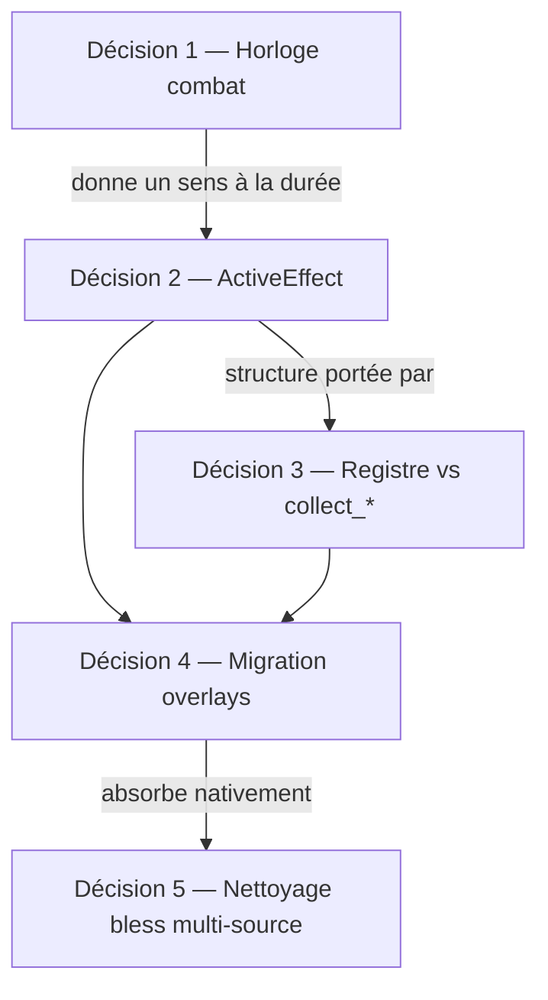

# ADR-006 — Modèle d'effets actifs, horloge combat, registre

| Attribut | Valeur |
|---|---|
| **Statut** | Accepté |
| **Date** | 2026-08-05 |
| **Contexte** | ADR-004 §530-532 (dette registre non résolue) ; lot B4 (commits `7a2f8a6`, `5b39f28`) |
| **Complète** | ADR-004 § B4, §530 ; dette overlays ad hoc post-B4 |

---

## Contexte

ADR-004 §530-532 identifie qu'une **durée sans décompte** est un cas dégénéré — même piège que le budget de déplacement inerte (C4). Le lot **B4** (`7a2f8a6`, `5b39f28`) a livré le pattern **`collect_*` → `effects[]`** (`hunters_mark.py`, `buffs/collect.py`) **sans** le registre curated promis (`rules/effects/registry.py`), **sans** structure `ActiveEffect`, **sans** horloge de durée.

Les champs overlay **`blessed: bool`** et **`hunters_mark_caster_id`** vivent sur la dataclass frozen **`Combatant`** (`jdr_engine/domain/combat/combatant.py`) — overlays ad hoc actés en MVP informel lors du cadrage B4, non formalisés dans un ADR.

Aujourd'hui, les buffs expirent uniquement via **concentration / recast / remplacement** (nettoyage B4) — jamais via un tour ou un round écoulé.

### Portée déploiement

**Dev pur** — aucune instance live avec combats `preparing` / `active` au 2026-08-05 (confirmé mainteneur). La **décision 4** (migration overlays) est traitée en **design-only** dans ce document.

### Couplages entre décisions



**Ordre de lecture / arbitrage** : 1 → 2 → 3 → 4 → 5 (dépendances logiques, pas l'ordre d'implémentation — voir annexe).

---

## Décision 1 — Horloge combat

### Constat

ADR-004 §530 : poser une durée sans mécanisme de décompte reproduit l'état inerte (movement C4, buffs sans horloge). Une horloge combat est le **prérequis** avant d'introduire `ActiveEffect` avec sémantique de durée (décision 2).

### Décision

**Ne pas introduire de nouveau compteur.** Réutiliser le champ existant **`CombatState.round_number`**, déjà incrémenté dans `advance_turn` lorsque `delta_round == 1`, avec publication de **`RoundStarted`** avant le **`TurnStarted`** du premier combattant du nouveau round :

```313:328:jdr_engine/game/combat_manager.py
        new_index, delta_round = result
        if delta_round:
            state.round_number += 1
            self._bus.publish(
                RoundStarted(
                    ruleset_id=state.ruleset_id,
                    combat_id=state.combat_id or str(combat_id),
                    guild_id=state.guild_id or "",
                    channel_id=state.channel_id or "",
                    round_number=state.round_number,
                )
            )
        state.turn_index = new_index
        self._persist(state)
        self._publish_turn_started(state)
        return state
```

**Portée horloge** : par combat ; reset implicite à **`close_combat`**. Pas de persistance inter-combat.

### Moment du décompte (tranché)

Expiration à l'**entrée** du round d'expiration, **borne exclusive** — sémantiquement alignée sur le **`RoundStarted(N)`** correspondant :

| Règle | Formulation |
|---|---|
| Application | `applied_at_round = state.round_number` au moment du cast |
| Expiration | `expires_at_round = applied_at_round + duration_rounds` |
| Tick | À l'**entrée** du round `N` (avant publication de `RoundStarted(N)`), retirer tout effet où `expires_at_round <= N` |

**Exemple** : cast au round 3, `duration_rounds = 10` → effet actif aux rounds 3–12, expire à l'entrée du round 13 (avant `RoundStarted(13)`). Aligné SRD « 1 minute = 10 rounds ».

Le tick est **synchrone** dans le flux d'avancement de tour (`advance_turn`), **avant** la publication de `RoundStarted` — afin qu'aucun consommateur EventBus n'observe un round déjà expiré côté effets. Testable unitairement sans instrumenter le bus.

**Rejeté** : tick via handler EventBus sur `RoundStarted` — ordre d'exécution implicite entre abonnés ; tick sub-round (option « tour individuel » par `advance_turn`) — complexité sans gain pour le MVP.

**Hors tick round** : `bless` et `hunters_mark` (concentration) — gérés par **`expiry_mode="concentration"`** (décision 2), pas par le décompte round.

### Alternatives rejetées

| Alternative | Motif |
|---|---|
| Nouveau `round_counter` | Doublon de `round_number` déjà testé (C2) |
| Horloge timestamp réel | Hors scope JDR tour-par-tour |
| Tick en fin de tour individuel | « 1 round » devient ambigu selon le nombre de combattants |

---

## Décision 2 — ActiveEffect

### Constat

ADR-004 avait reporté `ActiveEffect` **faute d'horloge** (§530). La décision 1 lève ce blocage.

### Décision — structure minimale

Typage aligné sur **`ActionKind`** (`jdr_engine/domain/combat/action_budget.py`) : alias **`Literal`**, pas d'`Enum` Python.

```python
from dataclasses import dataclass
from typing import Literal

ExpiryMode = Literal["concentration", "rounds", "manual"]


@dataclass(frozen=True)
class ActiveEffect:
    effect_id: str          # ex. "blessed", "hunters_mark"
    source_id: str          # combattant à l'origine (lanceur, attaquant)
    target_id: str          # combattant affecté
    applied_at_round: int   # round d'application (décision 1)
    expiry_mode: ExpiryMode
    duration_rounds: int | None = None  # requis si expiry_mode == "rounds"
```

**Validation au constructeur** : si `expiry_mode == "rounds"`, alors `duration_rounds` est **obligatoire** et **> 0**.

### ExpiryMode (tranché)

Alias **`Literal`** explicite à **trois valeurs** — pas de `None` implicite :

| Valeur | Sémantique | `duration_rounds` |
|---|---|---|
| **`"concentration"`** | Expire à rupture / recast / remplacement de sort (hooks B4 existants) | ignoré |
| **`"rounds"`** | Expire au tick décision 1 (entrée du round, avant `RoundStarted`) | **obligatoire** (> 0) |
| **`"manual"`** | Retrait explicite (`remove_effect`) ou fin de rencontre | ignoré |

### cleanup_on (tranché — absent en v1)

Le champ **`cleanup_on: list[str]`** n'est **pas porté en v1** — redondant avec `ExpiryMode` pour les cas actuels (`bless`, `hunters_mark`). Le nettoyage reste géré côté **registre** / **`combat_manager`** (pattern B4). Réintroduction possible si un effet **multi-trigger** apparaît ultérieurement.

### Portée immédiate vs hors scope

| Élément | Traitement |
|---|---|
| **`blessed`**, **`hunters_mark`** | Migrent vers `ActiveEffect` (décision 4) |
| **`frightened`**, **`poisoned`** | **Hors scope** — restent overlay blob-only (ADR-005) ; migration éventuelle en lot séparé si besoin explicite |

---

## Décision 3 — Registre vs `collect_*`

### Constat

`docs/COMBAT_PREP_MODELE.md` §6.7 proposait un registre curated **`jdr_engine/rules/effects/registry.py`** (mapping spell_id → modificateurs). Le lot **B4** a livré à la place des **`collect_*` dispersés** :

| Fichier | Rôle actuel |
|---|---|
| `rules/combat/buffs/hunters_mark.py` | Bonus +1d6 dans `apply_damage` |
| `rules/combat/buffs/collect.py` | `collect_buff_roll_effects` → `effects[]` pour `d20.py` |
| `rules/combat/conditions/collect.py` | Modèle C6 (conditions, hors scope ADR-006) |

Le pattern **fonctionne** et est couvert par les tests B4 (**817** tests au baseline post-B4). Il n'offre toutefois **aucun point central** d'inspection, de nettoyage générique, ni d'itération sur les effets actifs d'un combattant — dette actée ADR-004 §708.

### Persistance et hydratation (tranché)

| Aspect | Décision |
|---|---|
| **Source de vérité runtime** | Registre en mémoire (`rules/effects/registry.py`) |
| **Persistance** | Les `ActiveEffect` se **sérialisent dans le blob combat** existant (`CombatState` JSON) — **pas** de second chemin ni de store parallèle |
| **Champ blob** | Pas de duplication sur un champ séparé ad hoc de `CombatState` au-delà de la sérialisation des effets ; la **forme exacte** (tuple global vs dict par combattant) relève du **prompt d'implémentation** |
| **Rechargement** | **`load_combat`** reconstruit le registre depuis le blob — même pattern qu'ADR-005 (hydratation concentration overlay ← fiche si absent) |
| **Version blob** | Bump **`COMBAT_STATE_VERSION`** au premier effet effectivement migré (décision 4) |

**Rejeté** : registre purement éphémère (perdu au reload) ; store d'effets hors blob combat.

### Décision

**Coexistence temporaire** — pas de remplacement brutal du pattern B4.

| Composant | Rôle |
|---|---|
| **`rules/effects/registry.py`** (à créer) | Source de vérité pour les **`ActiveEffect`** créés (décision 2) |
| **`collect_*` existants** | Adaptateurs **temporaires** tant que les champs overlay legacy coexistent avec leur équivalent `ActiveEffect` (période de transition — décision 4) |
| **Nouveau code** (futurs sorts / buffs) | Passe **directement** par le registre — **pas** de nouveaux `collect_*` |

**Dépréciation progressive** : dernier lot d'implémentation (annexe) ; **ne bloque pas** les décisions 1, 2 et 4.

L'impact détaillé sur `hunters_mark.py` / `buffs/collect.py` sera documenté **au moment de l'implémentation** — pas de détail figé dans cet ADR.

### Justification

Éviter un big-bang sur du code B4 fonctionnel et testé — cohérent avec la prudence actée sur ADR-005 (pas de regroupement de dette non annoncée).

---

## Décision 4 — Migration overlays (design-only)

### Constat

Confirmé **2026-08-05** : aucune instance live, aucun combat persistant actif. **Pas d'ADR compatibilité descendante** requis pour ce lot.

### État actuel (`Combatant`)

Overlays legacy sur la dataclass frozen **`Combatant`** (`jdr_engine/domain/combat/combatant.py`) :

| Champ | Type | Helpers | Sérialisation blob |
|---|---|---|---|
| `hunters_mark_caster_id` | `str \| None` | `with_hunters_mark`, `without_hunters_mark` | `to_dict` / `from_dict` si non null |
| `blessed` | `bool` | `with_blessed`, `without_blessed` | `to_dict` / `from_dict` si `True` |

**Limite actuelle** : `blessed: bool` **n'a pas** de `blessed_by_caster_id` — le lanceur n'est pas traçable par cible ; c'est précisément ce qui empêche le nettoyage multi-source correct (décision 5).

### Modèle cible

| Overlay legacy | Remplacement `ActiveEffect` |
|---|---|
| `blessed: bool` | `ActiveEffect(effect_id="blessed", source_id=caster_id, target_id=…, expiry_mode="concentration", …)` — **un effet par cible bénie** |
| `hunters_mark_caster_id: str \| None` | `ActiveEffect(effect_id="hunters_mark", source_id=caster_id, target_id=marked_id, expiry_mode="concentration", …)` |

### Politique de transition

- Les champs overlay legacy sont **retirés** du modèle `Combatant` lors de la migration effective — **pas de double source de vérité** maintenue en dev pur.
- **`COMBAT_STATE_VERSION`** (`schema_version` blob) : bump **différé** au premier effet effectivement migré — pas immédiatement à la validation de cet ADR.

### Compatibilité blobs existants

> Compatibilité blobs existants = **ADR dédié** si et seulement si des instances live portent des combats `preparing` / `active` au moment du déploiement. Confirmé **absent** au 2026-08-05.

**Non-objectif** : script de migration de données — inutile, aucune base à migrer.

---

## Décision 5 — Nettoyage bless multi-source

### Constat actuel

Le nettoyage « **tous les `blessed`** » à la rupture de concentration (`_clear_concentration_spell_overlay_effects`) fonctionne **par accident** : **`blessed: bool` ne porte pas de `source_id`** (contrairement à `hunters_mark_caster_id` qui identifie au moins le lanceur sur la cible) — un seul clerc est supporté implicitement (MVP B4).

### Décision

Avec le registre (décisions 2 + 4), chaque **`ActiveEffect(effect_id="blessed")`** porte son **`source_id`** propre. La rupture de concentration d'un clerc ne nettoie que les effets dont **`source_id`** correspond à ce clerc.

**Conclusion** : absorbé **nativement** par les décisions 2 et 4 — **pas de lot séparé** requis. Le multi-clerc devient supporté sans code additionnel dédié — conséquence du modèle, pas un chantier en soi.

---

## Non-objectifs

| Élément | Motif |
|---|---|
| Refonte de la concentration existante | ADR-004, fonctionnelle (C5 + B4) |
| Modification de `close_combat` / ordre canonique | ADR-005, clos |
| Migration `frightened` / `poisoned` vers `ActiveEffect` | Overlay blob-only ; lot séparé si besoin |
| Script de migration de données | Aucune base à migrer (confirmé 2026-08-05) |
| **`prone`** (C6b), **movement** inerte (C4) | Dette isolée, hors cluster effets |
| Refactor **`_persist()` handler-only** | Chantier infra orthogonal (dette post-C7) |

---

## Tests attendus (post-implémentation)

| Fichier | Contenu |
|---|---|
| `tests/unit/test_active_effects.py` (**nouveau**) | Création, expiration par round, expiration par concentration, cleanup ciblé par `source_id` |
| `tests/unit/test_combat_buffs.py` (**existant**, B4 — **9 tests**) | Adaptation aux `ActiveEffect` ; suppression des assertions sur champs overlay retirés (`.blessed`, `.hunters_mark_caster_id`, `applied_effects` bless conservés) |
| `tests/unit/test_bless_multisource.py` (**nouveau**) | 2 clercs, rupture d'un seul, vérification que l'autre `bless` survit |

**Delta estimé** : +15 à +20 tests.

**Baseline actuelle** : **817** tests (`python -m unittest discover -s tests -p "test_*.py" -q`).

---

## Annexe — Ordre d'implémentation recommandé

Ordre **logique de livraison** (distinct de l'ordre de lecture des décisions ci-dessus) :

| Étape | Décision | Note |
|---|---|---|
| **1** | Horloge (décision 1) | Isolée, testable seule |
| **2** | `ActiveEffect` + registre squelette (décision 2) | Structure de données |
| **3** | Migration `blessed` / `hunters_mark` (décision 4) | Consomme 1 + 2 |
| **4** | Multi-source (décision 5) | Vérification ; pas de code dédié attendu |
| **5** | Dépréciation progressive `collect_*` (décision 3) | Nettoyage final ; **peut être différé** sans bloquer le reste |

---

## Références

- [ADR-004](ADR-004-modele-combat.md) — § B4, §530-532, dette registre
- [ADR-005](ADR-005-transition-fin-rencontre.md) — conditions encounter-scoped ; pas de sync overlay conditions
- `docs/COMBAT_PREP_MODELE.md` §6.7 — registre curated proposé (non livré tel quel en B4)
- Commits B4 : `7a2f8a6` (hunters_mark + nettoyage), `5b39f28` (bless + `roll_bonus_dice`)
- `jdr_engine/domain/combat/combatant.py` — overlays legacy, helpers, sérialisation
- `jdr_engine/domain/combat/combat_state.py` — `round_number`, `COMBAT_STATE_VERSION`
- `jdr_engine/domain/combat/action_budget.py` — précédent `Literal` (`ActionKind`)
- `jdr_engine/game/combat_manager.py` — `advance_turn`, `RoundStarted`
- `jdr_engine/rules/combat/buffs/collect.py` — pattern `collect_*` actuel
